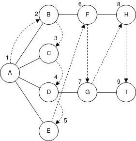

# Breadth-first Search

在 depth-first search 時，我們的策略是儘可能選擇遠離起始 vertex 的路徑，而 **breadth-first search** 則是儘可能保持到離起始 vertex 的地方。在 breadth-first search 時會先拜訪所有相鄰起始 vertex 的 vertex 後再開始選擇遠離的路徑，在實作上使用 queue 實作。

vertex A 是起始 vertex，所以我們先拜訪它並標示我們現在的位置在 vertex A 上，接下來套用以下 3 個規則：

> 規則 1
>
> 拜訪相鄰目前所在 vertex 的下一個尚未拜訪過的 vertex，標記成已拜訪並新增到 queue 中

> 規則 2
>
> 當已經沒有相鄰且未拜訪過的 vertex 時，取出 queue 中的 vertex ，移動到該 vertex。

> 規則 3
>
> 當 queue 為空時就完成 breadth-first search

因此我們一開始先拜訪所有相鄰 vertex A 的 vertex 並且依序新增到 queue 中，當我們拜訪過 A、B、C、D、E 後，queue 中由前至後會有 BCDE。

因為 vertex A 已經沒有相鄰且未拜訪過的 vertex，所以我們取出 vertex B 開始拜訪和它相鄰的 vertex，下一個相鄰的是 vertex F，因此我們拜訪它並新增到 queue 中。接著 vertex B 也沒有相鄰未拜訪過的 vertex，所以我們再取出 vertex C。vertex C 沒有任何相鄰未拜訪的 vertex，所以繼續取出 vertex D，然後拜訪它的相鄰未拜訪過的 vertex G。當 vertex D 沒有相鄰未拜訪過的 vertex 時，我們再取出 vertex E，此時 queue 中的元素是 FG，然後取出 vertex F 並拜訪它的相鄰未拜訪過的 vertex H，然後取出 vertex G 再拜訪 vertex I。

現在 queue 中的元素為 HI，當拜訪完這兩個 vertex 後，因為它們都沒有相鄰未拜訪過的 vertex，queue 會是空的，這時候我們就完成 breadth-first search。以下是每個步驟和當下 queue 的內容表：

| 步驟 | Queue \(由前到後\) |
| :--- | :--- |
| 拜訪 A |  |
| 拜訪 B | B |
| 拜訪 C | BC |
| 拜訪 D | BCD |
| 拜訪 E | BCDE |
| 移除 B | CDE |
| 拜訪 F | CDEF |
| 移除 C | DEF |
| 移除 D | EF |
| 拜訪 G | EFG |
| 移除 E | FG |
| 移除 F | G |
| 拜訪 H | GH |
| 移除 G | H |
| 拜訪 I | HI |
| 移除 H | I |
| 移除 I |  |
| 完成 |  |

queue 中的 vertex 是已拜訪過但尚未拜訪它的相鄰 vertex，這和 depth-first search 不同，depth-first search 的 stack 中是儲存從起始 vertex 到目前所在 vertex 的路徑，以上面的例子的話，breadth-first search 的拜訪順序會是 ABCDEFGHI。

因此 breadth-first search 有個有趣的特性，它首先找出所有距離起始 vertex 1 條 edge 距離的 vertex，接著是距離 2 條 edge 的，然後是距離 3 條 edge 的，以此類推慢慢增加距離。當想要找出從起始 vertex 到某特定 vertex 的最短距離時，這個特性就很有用，因為當我們拜訪到特定的 vertex 時，我們可以知道目前的 path 就是最短距離。

#### Java Code

請參照：[https://github.com/blackdiz/datastructrues\_and\_algorithms\_in\_java/blob/master/src/main/java/chapter13/graph/bfs/BreadthFirstSearch.java](https://github.com/blackdiz/datastructrues_and_algorithms_in_java/blob/master/src/main/java/chapter13/graph/bfs/BreadthFirstSearch.java)

