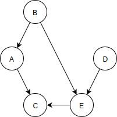

# Connectivity in Directed Graphs

如果是 non-directed  graph 我們可以用 depth-first search 或 breadth-first search 找到所有相連的 vertex。但如果是 directed graph，我們沒辦法從任意 vertex 開始用同樣的方式尋找：



如果從 vertex A 出發，到達 vertex C 時就結束了，如果從 B 出發則永遠沒辦法到達 D，而如果從 C 出發則完全沒有下一個 vertex。因此對相連關係而言，問題在於如果從特定的 vertex 開始則可以到達哪些其他的 vertex。

#### The Connectivity Table

如果我們對上面的 graph 用 depth-first search 會產生下面的相連關係表：

```text
AC
BACE
C
DEC
EC
```

 第一個字母表示起始 vertex，後續字母表示直接相連或經由其他 vertex 相連可到達的 vertex。

#### Warshall's Algorithm

某些情境下我們需要快速找到是否可以從某 vertex 到另一個特定的 vertex，比方飛行路線是否可以從城市 A 到達城市 B。

我們可以透過相連關係表找到答案，但這樣必須檢查相連關係表中以該 vertex 起始的列中元素確認是存在目的地的 vertex，如果 N 是起始 vertex 可到達的 vertex 數的平均，那就要花費 O\(N\) 的時間。

事實上可以藉由調整 adjacency matrix 得到一張表讓我們用 O\(1\) 的時間快速知道能否由特定 vertex 到另一特定 vertex，而由調整後的 adjacency matrix 繪出的 graph 稱作原 graph 的 **transitive closure** \(遞移閉包\)。

在 adjacency matrix 中，橫列的 vertex 表示 edge 的起始 vertex，而縱行的 vertex 表示終點 vertex，所以經由兩個 vertex 的交叉點可以直接看出這兩個 vertex 間是否有 edge 直接相連。

以下是上面 graph 的 adjacency matrix：

|  | A | B | C | D | E |
| :--- | :--- | :--- | :--- | :--- | :--- |
| A | 0 | 0 | 1 | 0 | 0 |
| B | 1 | 0 | 0 | 0 | 1 |
| C | 0 | 0 | 0 | 0 | 0 |
| D | 0 | 0 | 0 | 0 | 1 |
| E | 0 | 0 | 1 | 0 | 0 |

而我們可以用 Warshall 演算法將 adjacency matrix 轉換成 transitive closure。這個演算法的概念是：如果我們可以從 vertex L 到 vertex M 且 可以由 vertex M 到 vertex N，則我們可以由 vertex L 到 vertex N。

依循上述的概念我們從 2 條距離 1 步的 path 合為 1 條距離 2 步的 path，而 Warshall 演算法就依此原則推展至合為任意距離的 path。

以上面的 adjacency matrix 為例，我們開始一列列的檢視每個欄位。

* A 列：在 A 列中，C 欄的值是 1 表示有 A 到 C 的 path，如果已知有 X 到 A 的 path 我們就可以知道會有 X 到 C 的 path，而如果我們檢視 A 縱行的欄位值就可以列出以 A 為終點的 path。在表中  B 列的 A 欄是 1 所以有 B 到 A 的 path，綜合起來我們可以得出一條由 B 到 C 距離 2 步的 path，因此我們在新 adjacency matrix 的 B 列 C 欄位中寫入 1 做為標記。
* B、C 和 D 列：接著是 B 列中 A 欄位的值是 1，所以有 B 到 A 的 edge，但在檢視 B 縱行的欄位後沒有任何值為 1，表示沒有以 B 為終點的 edge，因此 B 到 A 已經是最長的 edge。在 C 列中則完全沒有以它為起點的 edge，而 D 列和 B 列是相同情形只有 D 到 E 的 edge。
* E 列： E 列中可以看到有 E 到 C 的 edge，而檢視 E 縱行後有 B 到 E 的 edge，因此可以得出 B 到 C 的 path，但 B 列 C 欄中已經有標記。另一條 edge 是由 D 到 E 所以得到由 D 到 C 的 path，因此在新 adjacency matrix 的 D 列 E 欄中寫入 1。

至此 Warshall 演算法就結束，新的 adjacency matrix 可以看出不論中間相隔多少 vertex，哪些 vertex 可以關連到其他的 vertex，如果以新的 adjacency matrix 繪出 graph 就得到原始 graph 的 transitive closure。

#### Implementation of Warshall's Algorithm

實作 Warshall 演算法的一種方式是用 Sedgewick 提出的 3 層巢狀迴圈，第 1 層迴圈檢視每一列，假設列編號變數為 `y` ，第 2 層迴圈檢視列中的每一欄，欄編號變數為 `x` 。如果在 `(x, y)` 格中的值是 1 表示有從 `y` 到 `x` 的 edge，這時就進入第 3 層迴圈，變數為 `z` 。

在第 3 層迴圈中由上往下檢視 `y` 縱行的欄位來找尋是否有以 `y` 為終點的 edge，如果在和 `z` 列的交叉點的值為 1 表示有從 `z` 到 `y` 的 edge，所以得到由 `z` 到 `x` 的 path，因此在 `(x, z)` 格中填入 1 做為標記。

