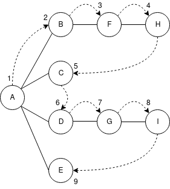

# Depth-First Search

depth-first search 用 stack 記錄當搜尋走到死路時接下來要到哪個 vertex，例如：

數字表示訪問 vertex 的順序。

要進行 depth-first search 需要先選擇起始的 vertex，這裡用 vertex A，接下來對 vertex 進行 3 個步驟：拜訪 vertex、將它新增到 stack 中、將它標示已拜訪過避免重複拜訪。

結束後移動到任一和 A 相鄰且尚未拜訪過的 vertex，假設依字母順序的話下一個是 vertex B，相同地拜訪 vertex B，將它標示成已拜訪，最後新增到 stack。

一直反覆進行，這個過程稱做規則 1：

> 規則 1
>
> 在允許的情況下拜訪相鄰且尚未拜訪過的 vertex，標示成已拜訪，新增到 stack

反覆套用規則 1 的話，最後會到 vertex H，這時候因為 vertex H 沒有任何相鄰的 vertex，所以我們套用規則 2：

> 規則 2
>
> 如果沒辦法套用規則 1 的話，那在情況允許下從 stack 中移除 vertex

藉由規則 2，我們將 vertex H 從 stack 中移除，下一個是 vertex F，同樣地 vertex F 也沒有相鄰的 vertex 所以我們也將它移除，下個 vertex B 的步驟也相同，最後剩下 vertex A。

這時 vertex A 還有沒拜訪過的相鄰 vertex C，所以我們就套用規則 1 到 vertex C。接著 vertex C 沒有相鄰 vertex，所以移除它後又剩下 vertex A。

然後下一個未拜訪過的是 vertex D，再次反覆套用規則 1 後會來到 vertex I，然後因為 vertex I 沒有相鄰 vertex，我們套用規則 2，最終回到 vertex A。

最後剩下未拜訪過的相鄰 vertex 是 vertex E，再套用規則 1 和規則 2 後，我們拜訪過 vertex E 再回到 vertex A。此時 vertex A 已經沒有任何未拜訪過的相鄰 vertex，所以我們將它從 stack 中移除，這時候 stack 為空時就符合規則 3 的狀況：

> 規則 3
>
> 如果無法套用規則 1 或規則 2 就已經完成

下列是過程中拜訪的 vertex 和當下 stack 內的狀況：

| Event | Stack |
| :--- | :--- |
| 拜訪 A | A |
| 拜訪 B | AB |
| 拜訪 F | ABF |
| 拜訪 H | ABFH |
| 移除 H | ABF |
| 移除 F | AB |
| 移除 B | A |
| 拜訪 C | AC |
| 移除 C | A |
| 拜訪 D | AD |
| 拜訪 G | ADG |
| 拜訪 I | ADGI |
| 移除 I | ADG |
| 移除 G | AD |
| 移除 D | A |
| 拜訪 E | AE |
| 移除 E | A |
| 移除 A |  |
| 完成 |  |

stack 的內容是我們從起始 vertex 到當下所在 vertex 的路徑，隨著遠離起始 vertex，我們將經過的 vertex 新增到 stack 中。在我們回到起始 vertex 的過程中，我們將經過的 vertex 從 stack 中移除，而整個過程中我們拜訪 vertex 的順序是 ABFHCDGIE。

depth-first search 的過程就像是儘快離開起始 vertex ，只有在到達死路也就是沒有任何相鄰 vertex 時再開始往走回到起始 vertex，所以 depth 可以指從起始 vertex 起算的深度。

## Depth-First Search and Game Simulations

depth-first search 經常用到遊戲策略或類似的情境中，在遊戲中我們可以從幾個行動中選出一個執行，每次選擇都會引發後面的選項最後形成 tree 形的 graph。graph 中每個 vertex 表示一個選擇的時間點，而特定的選項則由 edge 代表進而來到下一個選擇點 vertex。

比方井字遊戲中，如果我們先攻的話有 9 個可能的選項，而對手則剩下 8 個，每一次的選擇影響接下來對手可以選的選項，當對手選擇後也反過來影響我們接下來的選項，隨著遊戲進行雙方的選擇會互相影響直到格子全部填滿遊戲結束為止。

當我們決定如何選擇下一步時可以想像這次的選項可能導致對手的反應為何，然後當對手選擇特定的選項，我們可能的選擇有哪些，這樣反覆進行就可以藉由預想一系列的選擇來找出最佳的路線。在像井字遊戲這種簡單的遊戲中，選項的數量不多所以可以找出到遊戲結束為止所有可能的選項路徑，我們可以用 graph 來描繪出這些路徑，用我們選擇的第一步為起始 vertex，接著會有 8 條 edge 連接到對手可能選擇的 8 個選項上，而每個選項又會有 7 條 edge 連接到我們接下來可能選擇的 7 個選項，以此類推。因為第一步時有 9 種可能的選項，最後我們會有 9 個 graph 分別代表在我們第一步的 9 個選擇下可能產生的選擇路線，這樣形成的 tree 形 graph 稱為 **game tree** 。

game tree 中只有某些 path 可以到達成功的結局，當我們沿著 path 但最後到達的是失敗結局時我們就回到上一步的選擇改選取其他 path，這樣反覆嘗試直到走到成功的結局後我們就可以決定第一步要如何選擇。

由上述的分析可以看到即使是在簡單的遊戲中，選擇路徑的數量仍然相當多，如果忽略掉重複路徑的情況下會有 9 \* 8 \* 7 \* 6 \* 5 \* 4 \* 3 \* 2 \* 1 = 362,880 條路徑，如果是像棋類遊戲的話連超級電腦也無法計算到遊戲結局的情況，所以它們只能計算到一定的深度後估算當下有的最佳路徑。

## Java Code

請參照：[https://github.com/blackdiz/datastructrues\_and\_algorithms\_in\_java/blob/master/chapter13/graph/dfs/DepthFirstSearch.java](https://github.com/blackdiz/datastructrues_and_algorithms_in_java/blob/master/chapter13/graph/dfs/DepthFirstSearch.java)

