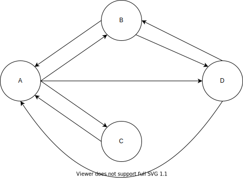

# Representing a Graph in a Program

#### Vertices

抽象地說，我們可以在程式中簡單地用 0 到 N - 1 的數字表示 vertex 而不需要用任何特別的結構儲存，因為重要的是它們之間的關係。

但大多數情形中 vertex 是代表現實世界的某物，而物件會有資料，比方 vertex 代表航班中的城市，那它就會有名稱、經緯度、位置等資料。因此通常會用一個類別來定義 vertex：

```java
class Vertex {
    public char label; // 比方 'A'
    public boolean wasVisited;
    
    public Vertex(char label) {
        this.label = label;
        wasVisited = false;
    }
}
```

vertex 可以儲存在 array 中並用 index 存取，也可以儲存在 list 或其他資料結構中。

#### Edges

由於每個 vertex 連接的其他 vertex 數不一，因此不適合用像 tree 這種 node 和其他 node 有固定連結數的結構描述 edge。有 2 種方式可以用來表示：**adjacency matrix** 和 **adjacency list** 。

#### The Adjacency Matrix

adjacency matrix \(相鄰矩陣\) 是用二維 array 的元素表示 edge。如果 graph 有 $$N$$ 個 vertex，則 adjacency matrix 會有 $$N \times N$$  個 array。

在 **non-directed graph** \(無向圖\) 時 adjacency matrix 會如下：

|  | A | B | C | D |
| :--- | :--- | :--- | :--- | :--- |
| A | 0 | 1 | 1 | 1 |
| B | 1 | 0 | 0 | 1 |
| C | 1 | 0 | 0 | 0 |
| D | 1 | 1 | 0 | 0 |

如果 vertex 間有 edge 則為 1，若無則是 0 \(也可以用 `true` 或 `false` 表示\)。以範例來說，A 和 B、 C 、D 都是相鄰的，而 B 和 A、D 相鄰。可以注意到 A 和 B 間的關係和 B 和 A 的關係是重複的，但因為在二維 array 中無法消除這種重複，所以當我們新增一條 edge 時必須同時記錄在兩個地方。

而在 **directed graph** \(有向圖\) 時，我們會固定一軸做為起點，另一軸做為終點，如下：

|  | A | B | C | D |
| :---: | :---: | :---: | :---: | :---: |
| A | 0 | 1 | 0 | 1 |
| B | 1 | 0 | 0 | 1 |
| C | 0 | 1 | 1 | 0 |
| D | 0 | 0 | 0 | 0 |

此時橫軸表示起點，而縱軸表示終點，比方橫軸 A 和縱軸 B 的交會點為 1 ，表示有 A -&gt; B 的 edge。

使用 adjacency matrix 的表示法缺點是使用較多空間，空間複雜度為 $$O(N \times N)$$。

#### The Adjacency List

另一種方式是 adjacency list \(相鄰列表\)，其中 list 表示 linked list。adjacency list 是一個儲存 list 的 array \(或者是用 list 儲存 list\)，每個 list 的元素表示相鄰的 vertex：

| Array of vertex | reference to List |
| :---: | :--- |
| A | B -&gt; C -&gt; D |
| B | A -&gt; D |
| C | A |
| D | A -&gt; B |

，表格中的 `->` 表示 linked list 中的連結方向，每個 link 代表一個 vertex。雖然表格中 list 內的 vertex 有順序但實際上並不需要排序。同時 list 內的連結不是 path ，vertex A 對應的 `B -> C -> D` 表示 A 和 B、C、D 相鄰而非由 A 到 D 的 path，在 **non-directed graph** \(無向圖\) 時 A 和 B、C、D 相鄰但沒有方向，而 A 的 List 中有 B 和 B 的 List 中的 A 是表示同一條 edge，畫成圖的話如下：


而在 **directed graph** \(有向圖\) 時則表示有由 A 到 B、A 到 C 、A 到 D 的 3 條有方向的 edge，，而 A 的 List 中有 B 和 B 的 List 中的 A 因為有方向的差異，所以是表示 A -&gt; B 和 B -&gt; A 兩條不同的 edge，畫成圖的話如下：



使用 adjacency list 的話，空間複雜度為 $$O(V + E)$$，$$V$$為 vertex 數而 $$E$$為 edge 數。

