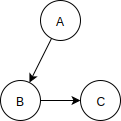

# Topological Sorting with Directed Graphs

**topological sorting** 是一種可以透過 graph 達成的操作，當物件或事件需要依特定順序排列時就可以派上用埸。在實際情境中，比方在高中和大學時，某些課程會要求先修完先修課程才可以修該門課：

#### Directed Graphs

在這樣的 graph 中，vertex 間的關聯是有順序的，因此 edge 必須有方向性，這種 graph 稱作 **directed graph** \(有向圖\)，在 directed graph 中只可往 edge 指向的方向移動，通常 edge 會有箭頭標明方向。

在程式中，non-directed graph 和 directed graph 的差別在 adjacency matrix 中只會有一組起迄 vertex 交叉的元素標記為相鄰，如：

在 adjacency matrix 中是：A

|  | A | B | C |
| :--- | :--- | :--- | :--- |
| A | 0 | 1 | 0 |
| B | 0 | 0 | 1 |
| C | 0 | 0 | 0 |

每一橫列代表起始的 vertex，而縱行表示終點 vertex，所以 A -&gt; B 的 edge 方向是將橫列 A 和縱行 B 的交叉元素標記為 1，如果二者交換則會是在橫列 B 和縱行 A 的交叉元素上標記。

如果是用 adjacency list 記錄，則 A 的 list 中會包含 B，但反過來 B 的 list 中不會包含 A。

#### 

