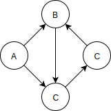

# Cycles and Trees

有一種 topological sorting 無法處理的狀況是 graph 中出現0 **cycles** ，cycle 指 path 的終點會回到起點的情況：

圖中 B - C - D - B 的 path 就形成 cycle。

沒有 cycle 的 graph 也被稱為 tree，如同 binary tree 和 multiway tree，但 graph 形成的 tree 不像 binary tree 和 multiway tree 有固定數量的 node，是更一般化的 tree。在 graph 中，只要不會形成 cycle，tree 裡的 vertex 可以連結到其他任意數的 vertex。在 non-directed graph 中，如果 N 個 vertex 有超過 N - 1 條 edge 就一定會有 cycle。

topological sort 只能適用在沒有 cycle 的 directed graph 上，這樣的 graph 也稱為 **directed acyclic graph \(DAG\)** 。 

