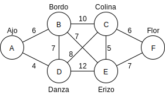

# Creating the Algorithm

#### The Priority Queue

如同在鋪設電視線路的例子中提到的，演算法的關鍵是維護一份鋪設城市間線路的費用清單，當要選擇下一次的路線時就選擇當下清單中最便宜的路線。

因為我們每次都選擇最便宜的路線，因此 priority queue 是個儲存路線記錄的好選擇，在較正式的實作上可能會用 heap 來實作這個 priority queue 以增加效能，但在這個簡單的範例中用 array 實作即可。

#### Outline of the Algorithm

現在用 graph 的角度重新整理一次演算法的過程。

從一個 vertex 開始，將它新增到 minimum spanning tree 中，接著重覆下列步驟：

1. 找出所有最新加到 tree 中的 vertex 和其他不在 tree 中 vertex 的相連 edge，將那些 edge 新增到 priority queue 中
2. 從 priority queue 中取出 weight 最小的 edge，將此 edge 和它的終點 vertex 新增到 tree 中

重覆進行直到所有 vertex 都已被新增到 tree 裡時演算法就結束了。

#### Extraneous Edges

在維護鋪設線路的費用清單時，我們會把含有新連接到目的地的城市的記錄刪除，因為該城市已被連接，如果不刪除掉可能會重複鋪設線路。

同樣地，在程式演算法中也要確保 priority queue 中沒有 edge 是連到當下已被加進 tree 中的 vertex。我們可以在每次把  vertex 加入 tree 時遍歷 priority queue 中每條 edge 並移除連到該 vertex 的 edge，但比較簡單的方法是在 priority queue 中只保留一條會連到其他尚未加進 tree 中的 vertex 的 edge，也就是如果 edge 所連到的終點 vertex 相同，則只會有 weight 較小的 edge 保留在 priority queue 中。

以城市的電視線路圖為例，每次在新增 edge 到 priority queue 時的狀況為：

| 步驟 | 未處理的 priority queue 內容 | 刪除重複目的地 vertex 取較小 weight 的 edge 後的 priority queue 內容 | 被刪除的 edge，括號內為和其重複而保留下的 edge |
| :--- | :--- | :--- | :--- |
| 1 | AB6, AD4 | AB6, AD4 |  |
| 2 | DE12, DC8, DB7, AB6 | DE12, DC8, AB6 | DB7\(AB6\) |
| 3 | DE12, BC10, DC8, BE7 | DC8, BE7 | DE12\(BE7\), BC10\(DC8\) |
| 4 | BC10, DC10, DC8, EF7, EC5 | EF7, EC5 | BC10\(EC5\), DC10\(EC5\), DC8\(EC5\) |
| 5 | EF7, CF6 | CF6 | EF7\(CF6\) |

這裡我們在每次要將 edge 加入 priority queue 時，檢查是否有相同終點的 edge，如果有則比較兩者的 weight，移除 weight 較大的 edge。

#### Java Code

請參照：[https://github.com/blackdiz/datastructrues\_and\_algorithms\_in\_java/blob/master/java/chapter13/graph/mstw/MinimumSpanningTreesOfWeightedGraph.java](https://github.com/blackdiz/datastructrues_and_algorithms_in_java/blob/master/java/chapter13/graph/mstw/MinimumSpanningTreesOfWeightedGraph.java)

