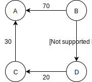

# The All-Pairs Shortest Problem

之前我們討論過用 Warshall 演算法建立 connectivity table 就可以快速知道是否可以從某 vertex 到另一指定 vertex，而在 weighted graph 的情境中 ，我們想要知道從任一 vertex 到其他 vertex 的最小花費為何，這種問題稱作 **all-pairs shortest-path problem** 。

我們可以透過將每個 vertex 作為 Dijkstra 演算法的起始 vertex 來建立出 connectivty table，這樣除了知道 vertex 間是否有 path 外還可知道最小花費為何，以之前的 graph 為例：

|  | A | B | C | D | E |
| :---: | :---: | :---: | :---: | :---: | :---: |
| A | - | 50 | 100 | 80 | 140 |
| B | - | - | 60 | 90 | 100 |
| C | - | 90 | - | 180 | 40 |
| D | - | 110 | 20 | - | 60 |
| E | - | 50 | 110 | 140 | - |

另一個方法是用 Floyd 演算法，由 Rober Floyd 在 1962 年發明，等於是 Warshall 演算法的 weighted graph 版本。以下用一個簡單的 weighted graph 為例：

| adjacency matrix | A | B | C | D |
| :---: | :---: | :---: | :---: | :---: |
| A |  |  |  |  |
| B | 70 |  |  | 10 |
| C | 30 |  |  |  |
| D |  |  | 20 |  |

我們的目標是建立出可以顯示出所有 path 的花費的表格，比方由 B 到 C 的花費是 B 到 D 的 10 加上 D 到 C 的 20，總和為 30。

如同用 Warshall 演算法時我們會系統性地檢視 adjacency matrix 一樣，這裡我們也是會逐列逐欄地檢視 adjacency matrix，如果有 weight 值比方 C 列 A 欄的 30，那我們接著就檢視 C 縱行的值，當看到 D 列 C 欄有 20 的 weight 值時，表示有 path 從 C 到 A 其 weight 為 30 和由 D 到 C 其 weight 為 20，因此我們可以合併出 1 條由 D 到 A 有 2 條 edge 的 path 其 weight 為 50，這時我們在 D 列 A 欄中填上 50。

接下來在 D 列中，A 欄位有剛剛填上的 50，所以我們檢視 D 縱行，在 B 列 D 欄有 weight 10，所以我們得出 B - D - A 的 path 其 weight 值為 60，但 B 列 A 欄已經有值 70，這個時候因為我們想要知道的是最小花費，所以每當有重複欄位的資料時都只保留最小值，因此我們將 B 列 A 欄的值改為 60。

以上就是 Floyd 演算法大致的做法，基本上和 Warshall 演算法雷同，差別只在於我們不只標記 vertex 間是否有 path 相連，同時要填入 path 的最小花費。

