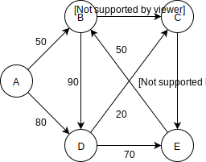

# Implementation

#### The Shortest-Path Array

Dijkstra 演算法一開始會從 adjacency matrix 中將起始 vertex 代表的 array 複製到另一個 array，新的 array 稱作 **shortest-path** array，也就是前面範例中最低票價表的當前記錄，換句話說會保持當下起始 vertex 到其他目的地 vertex 的最短路徑。

一開始 shortest-path 的內容為：

| A | B | C | D | E |
| :--- | :--- | :--- | :--- | :--- |
| inf \(A\) | 50 \(A\) | inf \(A\) | 80 \(A\) | inf \(A\) |

欄位中的數值為距離，而括號中的 vertex 為到達目的地 vertex 的前一個 vertex 稱作 **parent vertex**，所以目前我們知道 B 和 D 的 parent vertex 是 A，最後 inf 表示到該 vertex 的距離仍未知因此為無限遠。

#### Minimum Distance

一開始我們知道由起始 vertex A 到其他相距一條 edge 的 vertex 的距離，也就是相鄰的 vertex B 和 vertex D 的距離，演算法選擇最短距離的 vertex 加入 tree 中。

#### Column by Column in the Shortest-Path Array

接下來除了 A 到其他相鄰的 vertex 距離外，我們也有 B 到其他相鄰 vertex 的距離資料，所以演算法會遍歷 shortest-path array，看這些新資料會不會影響目前由 vertex A 到其他 vertex 的最短路徑。已經在 tree 中的 A 和 B 可以略過，接下來檢視的是 C，此時演算法發現 B 到 C 的距離為 60 比目前 shortest-path array 中的無限遠要短，同時演算法也知道由 A 到 B 的距離是 50，所以由 A 到 C 的距離總和為 110，因為 110 小於無限遠，所以我們要更新 shortest-path array 的元素，將 C 的無限遠修改為 110 \(B\)。

接著檢視 D，由 B 到 D 的距離為 90，而加上 A 到 B 的距離 50 後總和為 140 比目前的記錄 80 遠，因此不須修改 D 的值。

最後檢視 E，因為 B 無法到 E，所以該距離視為無限遠，而無限加上 A 到 B 的距離 50 後大於無限，因此也不須修改 E 的值。

此時，shortest-path array 的狀態為

| A | B | C | D | E |
| :--- | :--- | :--- | :--- | :--- |
| inf \(A\) | 50 \(A\) | 110 \(B\) | 80 \(A\) | inf \(A\) |

現在可以看出 parent vertex 的作用，parent vertex 是由起始 vertex A 到目的地 vertex 路徑上的中繼 vertex 記錄，C 的 parent vertex 為 B 表示路徑是由 A - B - C 組成，因此我們知道 graph  上的 edge 是如何連接。

#### New Minimum Distance

因為目前 shortest-path array 中的最短距離是到 D 的距離，所以接下來我們將 D 加入 tree 中。

#### Do It Again and Again

接著演算法又開始遍歷 shortest-path array 並做相對應的修改。

尚未加入 tree 中的 vertex 剩下 C 和 E，藉由和上述相同的步驟計算出由 A 經 D 到 C 的距離為 100，由 A 經 D 到 E 的距離為 150，所以我們更新 shortest-path array：

| A | B | C | D | E |
| :--- | :--- | :--- | :--- | :--- |
| inf \(A\) | 50 \(A\) | 100 \(D\) |  80 \(A\) | 150 \(D\) |

更新完後尚未加入 tree 中的最短距離 vertex 為 C，因此將 C 加入 tree 中。

最後剩下 E，E 可以經由 C 以最短距離 140 到達，而路徑為 A - D - C - E。此時的 shortest-path array 為：

| A | B | C | D | E |
| :--- | :--- | :--- | :--- | :--- |
| inf \(A\) | 50 \(A\) | 100 \(D\) |  80 \(A\) | 140 \(C\) |

最後將 E 加入 tree 中後沒有剩餘的 vertex 所以到此結束，shortest-path array 顯示由 A 到其他 vertex 的最短距離為何，而 tree 則顯示連接的狀況：AB、AD、DC 和 CE。

同時從 shortest-path array 可以建立最短路徑上經過的 vertex，以 vertex E 為例，它的 parent vertex 為 C，所以前一個連接的 vertex 為 C，而 C 的 parent vertex 為 D，D 的 parent vertex 為 A，因此路徑為 A - D - C - E。

#### Java Code

請參照：[https://github.com/blackdiz/datastructrues\_and\_algorithms\_in\_java/blob/master/java/chapter13/graph/dijkstra/ShortestPath.java](https://github.com/blackdiz/datastructrues_and_algorithms_in_java/tree/master/chapter13/graph/dijkstra)

