# General-Purpose Data Structures

如果想要儲存一些真實世界的資料如個人檔案、庫存等會使用一般用途的資料結構，包含 array、linked list、tree 和 hash table。稱它們為一般用途的結構是因為它們都用 key-value 的結構存取資料。

下面的思考方式大致呈現出如何針對問題選擇適當的資料結構：

#### Speed and Algorithms

這些資料結構大致上可以用速度分成兩類：array 和 linked list 速度慢， tree 速度快，hash table 速度極快。

但這不表示永遠都用操作快速的資料結構就是最好的選擇，首先它們的實作比起 array 和 linked list 更複雜，如果是 hash table 需要預先知道要儲存的資料量，而且 hash table 的記憶使用效率較差。至於 binary search tree 當輸入的 key 值是有序時，時間複雜度會惡化成 O\(N\)，而 balanced tree 雖然可以避免這個問題但實作難度較高。

#### Processor Speed: A Moving Target

