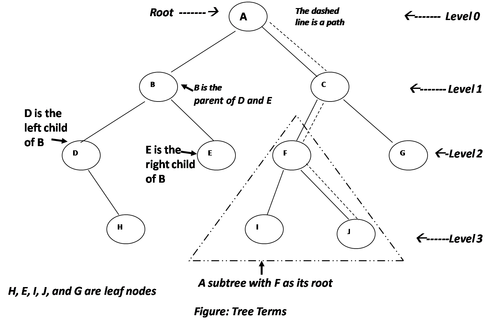

# Tree Terminology

下面的圖描繪出一個 tree 的各名詞:



#### Path

當沿著 edge 從某個 node 到另一個 node 時所形成的路線稱為 **path** 。

#### Root

tree 最頂端的 node 稱為 **root** ，一個 tree 只會有一個 root，而且必定會有一條且也只能有一條由 root 到 tree 裡任何其他 node 的 path。

#### Parent

除了 root 外，任何 node 必定只有一條 edge 連接於其上，而在其上的 node 稱作此 node 的 **parent** 。

#### Child

node 可能有一或多條 edge 連接於其下的 node，那些在下方的 node 稱為此 node 的 **child** 。

#### Leaf

沒有任何 child 的 node 稱為 **leaf** 或 **leaf node** ，一個 tree 只有會一個 root 但可能有多個 leaf。

#### Subtree

任一個 node 和它底下所有的 child 可以看成是另一個以它為 root 的 tree，這個 tree 稱作 **subtree** 。

#### Visiting

當程式對 node 存取操作時稱為 **visit** ，單純經過並不算是 visit 該 node。

#### Traversing

**traverse**  一個 tree 即以某種順序，如正序來遍歷 tree 裡所有的 node。

#### Levels

node 的 **level** 表示 node 從 root 開始算是第幾代，比方 root 是 level 0 的話，那 root 的 child 就是 level 1，而它 child 的 child 則為 level 2。

#### Keys

node 包含的資料即為 **key** 。

#### Binary Trees

如果每個 node 最多只可以有 2 個 child，我們稱作 **binary tree** 。從圖上來看，node 底下左邊的 node 稱為 **left child** ，而右邊的就稱為 **right child :**

```text
  1
 / \
2   3
^   ^
|   right child
left child
```

但 node 必不是一定要有 2 個 child，它可以只有 1 個 child 或沒有 child \(此時它就是 leaf\)。

而 binary tree 的一種特別型態稱為 **binary search tree** ，它的定義為：node 的 left child 的 key 必須小於它的 parent 的 key，且 right child 的 key 必須大於或等於 parent 的 key。

